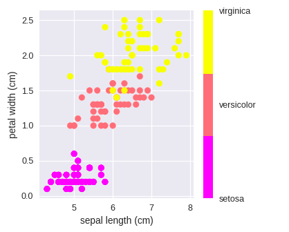

# Intro to Machine Learning

### Get to this repo! URL: [ml.sage.codes](https://github.com/sagecodes/intro-machine-learning) 

Learn more Python & tools for Data Science with the free Galvanize prep course: [http://bit.ly/gprepdata](http://bit.ly/gprepdata)

Get to this repo by typing in URL: **ml.sage.codes**

### FAQs: 

- WIFI: `Galvanize Guest Seattle` | Password is posted on the wall
- Bathrooms: Behind you down the hall to the left
- Kitchen outside back classroom door with Coffee & Tea!
- Snacks + water in back of room

## Setting up your computer
* A web browser to see what we're working on as others see it (Recommend Google Chrome: [chrome.google.com] (http://chrome.google.com))
* We will be using Google Colab for this workshop so make a Google account if you don't already have one. 
* Open this github Repo to follow along

# What this workshop is

A super friendly introduction to Machine Learning No previous experience expected, but knowing some python will help!

You can't learn EVERYTHING in ~2 hours, especially when it comes to Machine Learning! But you can learn enough to get excited and comfortable to keep working and learning on your own! 

- This course is for absolute beginners
- Ask Questions!
- Answer Questions!
- Help others when you can
- Its ok to get stuck, just ask for help!
- Feel free to move ahead
- Be patient and nice

We're not going to focus on the math behind the models. We're going to focus more on when and how to use a model. If you would like to go into the math and more about each model I encourage you to do so!

## About me:

Hello I'm [Sage Elliott](http://sageelliott.com/). I'm a Technology Evangelist here at Galvanize! For the past decade I've worked as a software and hardware engineer with Startups and Agencies in Seattle, WA and Melbourne, FL. I love making things with technology! 

I Originally got into Machine Learning by solving a manufacturing problem at my last job with computer vision, and I think its one of the coolest fields!

**Note:** I'm not a Galvanize Instructor, they're way better at teaching than I am!

- Website: [sageelliott.com](http://sageelliott.com/)
- Twitter: [@sagecodes](https://twitter.com/@sagecodes)
- LinkedIn: [sageelliott](https://www.linkedin.com/in/sageelliott/) 
- Email: [sage.elliott@galvanize.com](mailto:sage.elliott@galvanize.com)

Reach out to me if interested in:

- breaking into the tech industry 
- learning resources
- meetup recommendations 
- learning more about Galvanize
- giving me suggestions for events!
- being friends

## About you!

Give a quick Intro!

- Whats your name?
- Whats your background?
- Why are you interested in Machine Learning?

----

#### FAQs Again for anyone who just came in: 

- WIFI: `Galvanize Guest Seattle` | Password is posted on the wall
- Bathrooms: Behind you down the hall to the left
- Kitchen outside back classroom door with Coffee & Tea!
- Snacks + water in back of room

##### Get to this repo! 

URL: ml.sage.codes

##### Setup

- Moderen web browser 
- Google account 

# What is Machine Learning:

To put it very simply Machine Learning can usually be thought of using a statistical model built based on a dataset to solve a problem. 

Instead of explicitly programming an algorithm to do a specific task, we let it "learn" from data to find patterns and inference.

We'll see examples of this soon!

###  Who uses Machine Learning?

More and more companies using making decisions with data are using machine learning. Here are just a few examples that you've probably experiences as a customer.

#### Amazon

- Product Recommendations
- Amazon GO Computer Vision
- Alexa 
- Delivery Robots

#### Netflix

- Show & Movie Recommendations

#### Google

- Gmail Spam Filtering
- Google Assistance
- Youtube Content filtering & Recommendations
- Self Driving Cars

#### Apple

- Siri
- App Store Recommendations

#### Facebook

- Face Tagging Detection

#### Tesla

- Self Driving Cars

These companies use Machine Learning in many other ways!

### Machine Learning Applications

We talked about a some examples above from big companies we probably all know of. But here are several more types of applications that machine learning has become popular with.

#### Healthcare

- Cancer Detection
- X-Ray diagnostic 

#### Smart Home Devices

- Smart door Bell
- Smart Lights
- Security

#### Image generation

- [NVIDIA’s Hyperrealistic Face Generator](https://medium.com/syncedreview/gan-2-0-nvidias-hyperrealistic-face-generator-e3439d33ebaf)
- video game Character or level generation
- [art generation](https://www.artnome.com/news/2018/3/29/ai-art-just-got-awesome)

#### Agriculture

- Crop monitoring & planning

#### Supply Chain 

- Sourcing and Shipping Automation

#### Manufacturing 

- Quality Assurance
- Design

#### Fraud Detection

- Credit cards
- Product listings

You can see how all of these applications revolve around finding patterns in data!

# Types of Machine Learning:

## Supervised Learning

Supervised Learning uses a dataset that is labeled. In this context imagine having a list of features and a label(group) that those features belong to.

Here we have features(sepal length (cm), etc) and a label(Flower Species)

| sepal length (cm)  | sepal width (cm)  | petal length (cm)  | petal width (cm)  |  Species | 
|---|---|---|---|---|
| 5.1 |  3.5 |  1.4 |  0.2 | setosa| 
| 5.7	| 2.9 | 4.2 | 1.3 | versicolor | 
| 7.7 | 3.0  | 6.1  | 2.3  |  virginica |

We could use a full dataset with data like above to make a prediction of the flower species given only the Petal and Sepal Lengths.

Another good example of supervised learning is a email spam filter. 

Say we have a bunch of emails in our dataset and they all have a label of either `spam` or `not_spam`. We could then train a supervised learning model to look at all of those emails and pick up patterns that show up in the spam emails. There are probably certain words or formatting that repeat them selves. If you've ever looked in your email spam folder you can probably pick out some of those things yourself!

There are 2 main types of supervised learning Classification and Regression:

### Classification

Classification tries to assign the correct label to a new piece of data not containing a label. Both examples above are good examples of classification problems.

Spam filter would look at an email and decide if it should be labeled as `spam` or `not_spam`

We could be given a new flower measurement and we want to try to label it with the correct Species: `setosa`, `versicolor`, `virginica`

| sepal length (cm)  | sepal width (cm)  | petal length (cm)  | petal width (cm)  |
|---|---|---|---|
| 5.1 |  3.5 |  1.4 |  0.2 |  

According to a model I trained it thinks this would be `versicolor`. 

### Regression

Instead of predicting a label like classification, Regression predicts a value. 

This example has features `crime rate`, `Zoning`, `rooms`, `square footage` and a value `price`. 

| crime rate | Zoning  | rooms  | square footage  | price |
|---|---|---|---|---|
| .5 |  3.5 |  5 |  1400 |  100000 |
| .2 |  2 |  3 |  3000 |  50000 |
| .3 |  4 |  7 |  1800 |  150000 |

Unlike the classification example where we tried to predict what group features belonged to, we want to predict what value the features would have. This could be a number ranging anywhere! 

Given a list of new features from a house like below, we would then want to find out how much that house is worth by predicting a number value.

| crime rate | Zoning  | rooms  | square footage  |
|---|---|---|---|
| .7 |  4 |  2 |  1000 |

Some other examples to think about Predicting:
- Stock price 
- Age

This workshop is going to focus on supervised Machine Learning, but we'll talk briefly about some of the other types!

## Unsupervised Learning

Unsupervised Learning uses a dataset that is not labeled and gains insight about its patterns.

### Clustering 

A common way of using unsupervised learning is clustering.

This picture shows an example of visualizing the [Iris Dataset](https://en.wikipedia.org/wiki/Iris_flower_data_set) we talked about before. We can see that there are features that relate to each species. If we didn't have those labels we could use unsupervised learning to create clusters separating the groups out that would probably look pretty similar to this. We could then add a label to those clusters.

An example to think about is if you have a large dataset of customers. Maybe you would like to segment them out to cluster similar customers. 

## Semi-Supervised Machine Learning

Uses mixed dataset labeled with labeled and unlabeled to train the model and a combination of supervised and unsupervised machine learning.

Semi Supervised Machine learning can be important to look into if you don't have enough labeled data to create a good model. Labeling and acquired labeled data can be extremely expensive / time consuming so developing a model that can use both types of data is super intriguing!  

Imagine trying to label every piece of information you get from a self driving car! You have a constant video feed, Lidar, and other sensors. 

## Reinforcement Learning

Reinforcement Learning is often used in a situation where an algorithm can take an action in an environment and receive a `reward` based on making a good design.

You see a lot of example of this type of machine learning used to make computers excellent gamers!

A couple examples:

[Open AI Gym](https://gym.openai.com/)

[Flappy Bird](https://github.com/yenchenlin/DeepLearningFlappyBird)

[Sonic](https://www.linkedin.com/feed/update/urn:li:ugcPost:6547147121580220416)

## Deep Learning

Deep Learning is a subset of Machine Learning. 

It uses layers of [Artificial Neural Networks](https://en.wikipedia.org/wiki/Artificial_neural_network) and can learn from data to change the weights of the neurons. 

[A Neural Network Playground - TensorFlow](https://playground.tensorflow.org/#activation=tanh&batchSize=10&dataset=circle&regDataset=reg-plane&learningRate=0.03&regularizationRate=0&noise=0&networkShape=4,2&seed=0.24541&showTestData=false&discretize=false&percTrainData=50&x=true&y=true&xTimesY=false&xSquared=false&ySquared=false&cosX=false&sinX=false&cosY=false&sinY=false&collectStats=false&problem=classification&initZero=false&hideText=false) is a great place to start tinkering around and learning more about Artificial Neural Networks! 

Deep Learning is killing it at recognising and generating complicated patterns. 

- Computer vision (CV)
	- Self Driving cars
	- Amazon Go
		
- Natural Language Processing (NLP)
	- Alexa
	- Siri
 
- Generative Adversarial Networks (GANs)
	- [NVIDIA’s Hyperrealistic Face Generator](https://medium.com/syncedreview/gan-2-0-nvidias-hyperrealistic-face-generator-e3439d33ebaf)
	- video game Character or level generation
	- [art generation](https://www.artnome.com/news/2018/3/29/ai-art-just-got-awesome)

---

For this class we're going to stay focused on Supervised Machine learning. It's a great place to start!

But out of all these what would you like to see a class on next?

## Supervised Learning Models

Some of the common models. Having an idea of what these do and applications they should be used for is important! I will only briefly go over them so please read more about them!

#### [Linear Regression](https://en.wikipedia.org/wiki/Linear_regression)

Typically used for **regression**

Generally regression problems predict a value on a continuous spectrum 

#### [Logistic Regression](https://en.wikipedia.org/wiki/Logistic_regression)

Typically used for **classification**

NOT used for regression problems! Has regression in the same due to the statistics behind the model.

Used to predict binary outputs (yes, no | true, false | Pass, fail)

looking for probability above a certain threshold

if .5 

#### [K-Nearest Neighbors](https://en.wikipedia.org/wiki/K-nearest_neighbors_algorithm)

Typically used for **classification**

k-NN finds the `k` number of nearest data points and makes a `educated` guess based on the classifications of the nearest datapoint.

#### [Decision Trees](https://en.wikipedia.org/wiki/Random_forest)

Typically used for **classification**

Maybe an over simplification but a Decision tree can be thought of like a bunch of if statements. 

You've probably seen flow chats before with different paths to take depending on the data.

#### More
There are of course more than these 4 models, a few more popular ones you should look into are [Support Vector Machines](https://en.wikipedia.org/wiki/Support-vector_machine), [Random Forests](https://en.wikipedia.org/wiki/Random_forest), and [Naive Bayes](https://en.wikipedia.org/wiki/Naive_Bayes_classifier).

### How do you choose the algorithm?

There can be a lot of factors to consider, like the size of data, Labels, Accuracy, Scalability, etc... A lot of these out of the scope for this workshop.

But when you're first starting out It's important to think about your desired outcome(output of the model).   

- Is it a number? Its probably a Regression problem.
- Is it a class / label? Its probably a classification problem.
- Are you separating unlabeled data into groups? It’s probably a clustering problem.

https://scikit-learn.org/stable/tutorial/machine_learning_map/

# Some Basics Terms:

We can only scratch the surface of Machine Learning tonight in this workshop, so this is by no means everything you need to know, but it should help you get started!

##### fitting

Training your model on your dataset. You'll see terms like fit and train used interchangeably

##### [overfitting](https://en.wikipedia.org/wiki/Overfitting)

relies too much the relationships in training data, Fails to work correctly on new data.

##### [underfitting](https://en.wikipedia.org/wiki/Overfitting#Underfitting)

Fails to learn the relationships in the training data to be used on new data

##### [cross validation](https://en.wikipedia.org/wiki/Cross-validation_(statistics))

Validate that your machine learning model is working on well on data that it was not trained on. 

We trained the model, but need to validate that its working as expected. A common way is to split the dataset into training and testing(We'll do this soon in python).

# Machine Learning with Python:

## Popular Python Data & Machine Learning Libraries

Again this just some of them, there are soooooo many.....

#### [Pandas](https://pandas.pydata.org/)

Pandas is often used to explore, clean, and visualize your data.

#### [Numpy](http://www.numpy.org/)

Numpy is often used for muulti dimensional array manipulation

#### [matplotlib](https://matplotlib.org/)

matplotlib is often used to visualizing your data in a chart like format

#### [Scikitlearn](https://scikit-learn.org/stable/)

Scikitlearn a.k.a. sklearn is a powerfil opensource machine learning libray

#### [Tensorflow](https://www.tensorflow.org/)

Library from Google for Machine Learning. Popular in Deep Learning.

#### [Pytorch](https://pytorch.org/)

Library from Facebook for Machine Learning. Popular in Deep Learning.

#### [Keras](https://keras.io/)

A higher level wrapper that can be used with TensorFlow to make writing deep learning projects easier.

#### [NLTK](https://www.nltk.org/)

An opensource library to get started with NLP.

#### [OpenCV](https://opencv.org/)

An opensource library to get started with computer vision and image manipulation.

*Note*: if you're thinking of exploring data science with python locallyClassification on your computer look into using [Anaconda](https://www.anaconda.com/) to manage your python and data libraries. I'd go crazy without it!

## Classification Project

[Iris Dataset](https://en.wikipedia.org/wiki/Iris_flower_data_set)

Looking at this data how do we know that Classification will be a good choice? Why not Regression?

### >>> [Iris K-Nearest Neighbors](https://colab.research.google.com/drive/1X-lhBr1yrhVME_IISx2MbjkvG6mqyg3D) <<<

## Regression Project

[Boston House Dataset](https://www.kaggle.com/c/boston-housing)

Looking at this data how do we know that regression will be a good choice? Why not Classification?

### >>> [Boston House price Linear Regression Notebook](https://colab.research.google.com/drive/1MlnhYzxanrUoD5FRp2-b6aX_F9e6lrfs) <<<

# YOU MADE IT THROUGH!

Did you learn something new?

Do you feel more comfortable with the ideas of Machine Learning?

Do you have an awesome idea you want to use try using machine learning? What is it?

## KEEP LEARNING!

Best way to learn is solving a problem you're excited about!

Challenges:

- Use an "ugly" dataset. Understanding how to make a good dataset is important. 

- Scikit Learn has more built in [datasets](https://scikit-learn.org/stable/datasets/index.html). Use them and apply what you learned today!

- Use the SHAP library on a model you trained to understand the importance of features. 

- [Hack Reactor Software Engineer Prep](http://bit.ly/gsoftprep) FREE | study at your own pace

- [Galvanize Data Science Prep Course](http://bit.ly/gprepdata) - FREE | study at your own pace

## Upcoming Events!

Visit the [Learn to code Seattle](https://www.meetup.com/Learn-Code-Seattle/) meetup for all upcoming events.

- [Data Science Study Session](https://www.eventbrite.com/e/data-science-study-session-tickets-63354939329) - 6/25/19 6:00pm 

More workshops in July Workshops will be posted soon!

# What is Galvanize?

> We create a technology ecosystem for learners, entrepreneurs, startups and established companies to meet the needs of the rapidly changing digital world.

- Education
- Co-Working
- Events
- Enterprise

## Galvanize Classes

### Immersive Bootcamp

#### On Campus
Transform your career with our immersive programs

- [Software Engineer](http://bit.ly/seawebdev) (18 weeks) - 6/3/19 - 10/11/19
- [Data Science](http://bit.ly/seadatascience) (13 weeks) - 8/19/19 - 11/15/19

#### Remote 
- [Software Engineer](http://bit.ly/seremote) (12 weeks) - 7/15/19 - 10/11/19 
- [Software engineer | Part-time](http://bit.ly/seremotep) (36 weeks) - 7/23/19 - 4/11/19
- [Data Science](http://bit.ly/dsiremote) (13 weeks) - 8/19/19 - 11/15/19

#### Remote Part time fondations:

- [Data Science Fundamentals: Intro to Python](https://www.eventbrite.com/e/data-science-fundamentals-intro-to-python-remote-708-725-tickets-63483954216) 7/8/19 - 7/25/19

#### Co-working Space

[work in our building!](https://www.galvanize.com/entrepreneur)

## Questions

Please feel free to reach out to me with any questions! Let me know what you're planning to do next and how I can help!

- Website: [sageelliott.com](http://sageelliott.com/)
- Twitter: [@sagecodes](https://twitter.com/@sagecodes)
- LinkedIn: [sageelliott](https://www.linkedin.com/in/sageelliott/) 
- Email: [sage.elliott@galvanize.com](mailto:sage.elliott@galvanize.com)

